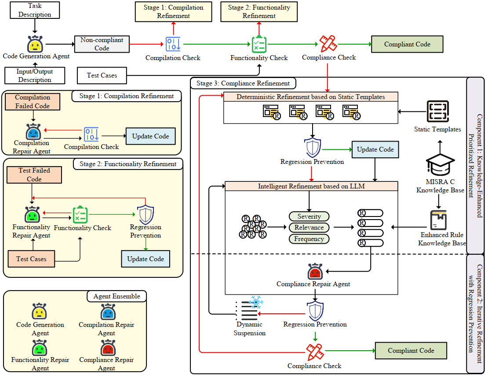

# HI-MISRA

> LLM-based MISRA C Violation Detection & Safe Code Synthesis

## Overview

HI-MISRA is a research project that leverages Large Language Models (LLMs) to detect MISRA C rule violations in C/C++ code and synthesize safer alternatives. It integrates with [Cppcheck](https://cppcheck.sourceforge.io/) for static analysis and supports multiple LLM backends (OpenAI, DeepSeek, Gemini, Claude) for intelligent code reasoning.



## Project Structure

```
HI-MISRA/
├── src/
│   ├── check/                 # Core MISRA checking module
│   │   └── misra_check.py     # Cppcheck + MISRA violation detection engine
│   ├── pipeline/              # Code generation & refinement pipeline
│   │   ├── generate/          # Code generation pipeline
│   │   │   ├── infer_base.py  # LLM-based code generation
│   │   │   ├── combine.py     # Merge temporary results into JSONL
│   │   │   ├── harness.py     # Compile and evaluate generated code
│   │   │   └── statistic.py   # Statistical summary of generation results
│   │   └── refine/            # Iterative refinement pipeline
│   │       ├── refine_explain.py          # Knowledge-guided refinement (HI-MISRA)
│   │       ├── reharness.py               # Re-evaluate refined code
│   │       └── statistic_refine_compare.py # Compare refinement results
│   ├── knowledge_build/       # MISRA knowledge construction
│   │   ├── check_misra.py     # Knowledge quality check & retry
│   │   └── explain_misra.py   # Rule explanation generation
│   ├── utils/                 # Shared utilities
│   │   ├── logger_util.py     # Logging utilities
│   │   ├── json_util.py       # JSON I/O helpers
│   │   └── refine_util.py     # Refinement utilities
│   └── model_config.py        # LLM API configuration (env-based)
├── srcipt/                    # Shell scripts for batch experiments
│   ├── pipeline/              # Experiment pipeline entry points
│   │   ├── gen_pipeline.sh    # Code generation pipeline
│   │   └── refine_pipeline.sh # Code refinement pipeline
│   └── knowledge_build/       # Knowledge base build scripts
│       ├── explain.sh
│       └── check.sh
├── data/                      # Datasets and MISRA rule files
├── addons/                    # Cppcheck addon resources
├── test/                      # Test scripts
├── setup.py                   # Package setup
├── pyproject.toml             # Build system config
└── .gitignore
```

## Getting Started

### Prerequisites

- Python ≥ 3.8
- [Cppcheck](https://cppcheck.sourceforge.io/) installed and available in `PATH`
- LLM API keys (set via environment variables)

### Installation

```bash
git clone <repo-url> && cd HI-MISRA

pip install -e .
```

### Environment Variables

Configure your LLM API keys via environment variables:

```bash
export OPENAI_API_KEY="your-key"
export OPENAI_BASE_URL="https://api.openai.com/v1"

export DEEPSEEK_API_KEY="your-key"
export GEMINI_API_KEY="your-key"
export CLAUDE_API_KEY="your-key"
```

## Knowledge Build (`src/knowledge_build`)

Automated construction module for the MISRA C rule knowledge base. The overall pipeline:

```
misra.txt ──→ explain_misra.py ──→ misra_explaination.json ──→ check_misra.py ──→ Quality-checked JSON
 (rule text)    (batch LLM gen)       (knowledge base)          (quality check + retry)
```

- **`explain_misra.py`** — Reads MISRA C rule text, calls LLM concurrently with multi-threading to generate structured explanations for each rule (detailed description, non-compliant code examples, and compliant code examples). Auto-saves every 20 rules to prevent data loss on interruption.
- **`check_misra.py`** — Scans the generated knowledge base, automatically detects abnormal entries (parse failures, missing fields, etc.) and re-generates them via LLM. Supports `--check_only` mode for inspection only and `--retry_id` for targeted rule retry.

The generated knowledge base provides MISRA rule explanations and compliant/non-compliant examples as reference context for the LLM during the code refinement pipeline (`pipeline/refine`).

## Experiment Pipeline

The experiment entry points are located in `srcipt/pipeline/`. The full pipeline consists of two stages:

### Stage 1: Code Generation (`gen_pipeline.sh`)

Generates C code from benchmarks using LLMs, compiles and evaluates for correctness, then collects MISRA violation statistics.

```bash
# Usage: srcipt/pipeline/gen_pipeline.sh <model_index1> [model_index2] ...

# Generate code using GPT-5-mini (index 0)
bash srcipt/pipeline/gen_pipeline.sh 0

# Generate code using multiple models (GPT-5 and Claude)
bash srcipt/pipeline/gen_pipeline.sh 1 4
```

**Pipeline steps**: `infer_base.py` → `combine.py` → `harness.py` → `statistic.py`

### Stage 2: Code Refinement (`refine_pipeline.sh`)

Refines the generated code using HI-MISRA's knowledge-guided approach to reduce MISRA violations, then evaluates and compares results.

```bash
# Usage: srcipt/pipeline/refine_pipeline.sh [options] <model_index>

# Run HI-MISRA refinement for GPT-5-mini (index 0)
bash srcipt/pipeline/refine_pipeline.sh --explain 0

# Run with custom iteration count and no cache reuse
bash srcipt/pipeline/refine_pipeline.sh --explain --max-iters 5 --no-reuse 0
```

**Pipeline steps**: `refine_explain.py` → `reharness.py` → `statistic_refine_compare.py`

**Options**: `--reuse` / `--no-reuse` (cache control), `--max-iters <N>` (max refinement iterations, default: 3)

### Model Index Reference

| Index | Model Family | Model Name |
|-------|-------------|------------|
| 0 | OpenAI | gpt-5-mini |
| 1 | OpenAI | gpt-5 |
| 2 | Gemini | gemini-2.5-flash |
| 3 | Claude | claude-3-7-sonnet |
| 4 | DeepSeek | deepseek-chat |

## License

This project is for research purposes. Please refer to the license file for details.
